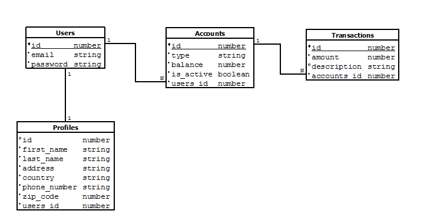

# API REST en Laravel



Este proyecto es una API sencilla creada por motivos de práctica. Hecho en [Laravel](https://laravel.com/) usando la librería [Laravel JSON-API](https://laravel-json-api.readthedocs.io/en/latest/), que facilita la creacion de JSON APIs.

## Requisitos

* PHP >= 7.2

## Instalación

Crea un archivo .env con la configuración de tu base de datos, luego ejecuta el siguiente comando:

```
$ composer start
```

`composer start` es un comando personalizado, que vendría a ser el equivalente a:

```
$ composer install
$ php artisan migrate --seed
$ php artisan serve
```

Si tienes problemas con el script, intenta ejecutar cada comando por separado.


## Usando la API

La API sigue las especificaciones mencionadas en [jsonapi.org](https://jsonapi.org), por lo que se recomienda su lectura antes de trabajar con la API.

Cada petición al servidor debe contener el siguiente header para ser aceptado:

```
 Content-Type: application/vnd.api+json
```

Y las peticiones deben estar escritas como un objeto JSON como se ve en los ejemplos

#### Ejemplo GET

Obtener la lista de usuarios registrados:

```
GET /api/v1/users
Content-Type: application/vnd.api+json
Accept: application/vnd.api+json
```

Respuesta:

```json
{
    "data": [
        {
            "type": "users",
            "id": "1",
            "attributes": {
                "email": "luna38@example.com"
            },
            "relationships": {
                "profiles": {
                    "links": {
                        "related": "http://localhost:8000/api/v1/users/1/profiles"
                    }
                },
                "accounts": {
                    "links": {
                        "related": "http://localhost:8000/api/v1/users/1/accounts"
                    }
                }
            },
            "links": {
                "self": "http://localhost:8000/api/v1/users/1"
            }
        }
		...
		...
		...
```


#### Ejemplo POST

Crear una cuenta de ahorro para el usuario cuyo ID es 1:

```json
POST /api/v1/accounts
Content-Type: application/vnd.api+json
Accept: application/vnd.api+json

{
	"data":{
		"type":"accounts",
		"attributes":{
			"account_type":"Ahorro",
			"balance":"1000",
			"is_active":true
		},
		"relationships":{
			"users":{
				"data":{
					"type":"users",
					"id":"1"
				}
			}
		}
	}
}
```

Respuesta:

```json
HTTP 1.1 201 Created

{
    "data": {
        "type": "accounts",
        "id": "51",
        "attributes": {
            "account_type": "Ahorro",
            "balance": "1000",
            "is_active": true,
            "created-at": "2019-08-05T17:41:27+00:00"
        },
        "relationships": {
            "users": {
                "links": {
                    "related": "http://localhost:8000/api/v1/accounts/51/users"
                }
            }
        },
        "links": {
            "self": "http://localhost:8000/api/v1/accounts/51"
        }
    }
}
```


#### Ejemplo PATCH

Actualizar la cuenta introducida anteriormente:

```json
PATCH /api/v1/accounts/51
Content-Type: application/vnd.api+json
Accept: application/vnd.api+json

{
	"data":{
		"type":"accounts",
		"id":"51",
		"attributes":{
			"account_type":"Corriente",
			"balance":"2000",
			"is_active":true
		},
		"relationships":{
			"users":{
				"data":{
					"type":"users",
					"id":"1"
				}
			}
		}
	}
}
```

Respuesta:

```json
HTTP 1.1 200 OK

{
    "data": {
        "type": "accounts",
        "id": "51",
        "attributes": {
            "account_type": "Corriente",
            "balance": "2000",
            "is_active": true,
            "created-at": "2019-08-05T17:41:27+00:00"
        },
        "relationships": {
            "users": {
                "links": {
                    "related": "http://localhost:8000/api/v1/accounts/51/users"
                }
            }
        },
        "links": {
            "self": "http://localhost:8000/api/v1/accounts/51"
        }
    }
}
```


## Test Unitarios

El proyecto viene con PHPUnit 8.1.3 y test preparados para probar la API. Para ejecutar los tests, usa el siguiente comando:

```
$ composer tests
```

`composer tests` es un comando personalizado, que vendría a ser el equivalente a:

```
$ vendor\bin\phpunit
```